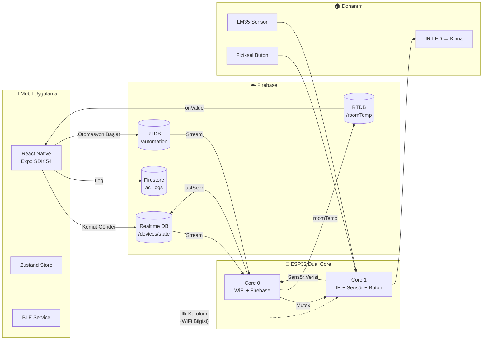
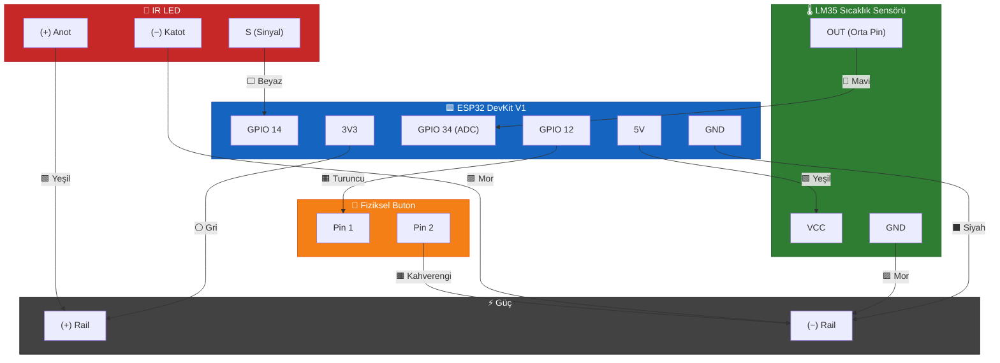
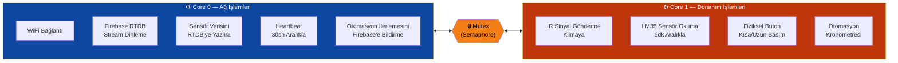
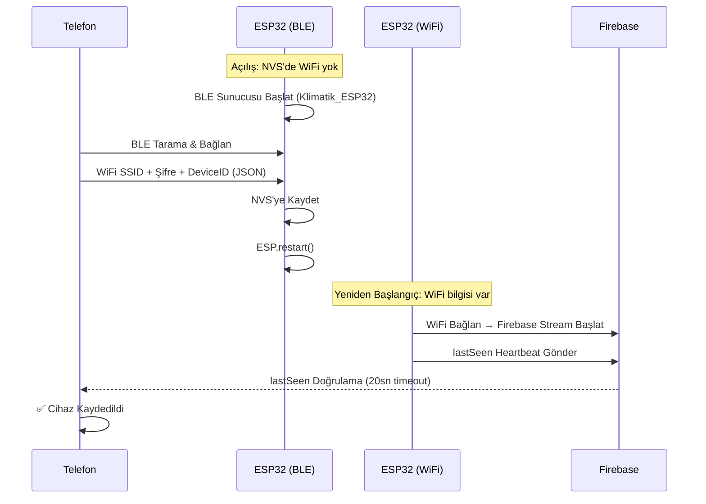
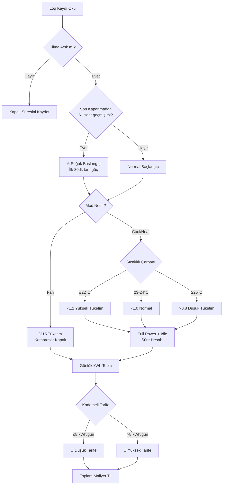

<p align="center">
  
</p>

<h1 align="center">🌡️ Klimatik</h1>
<h3 align="center">Akıllı Klima Kontrol & Enerji Yönetim Sistemi</h3>

<p align="center">
  
  
  
  
  
  
  
</p>

<p align="center">
  ESP32 mikrodenetleyici + React Native (Expo) mobil uygulama + Firebase altyapısı ile sıfırdan geliştirdiğim,<br/>
  fiziksel klimayı telefondan (ve fiziksel butonla) kontrol eden, enerji tüketimini kademeli tarife bazında hesaplayan,<br/>
  senaryo tabanlı otomasyon sunan tam kapsamlı bir IoT projesi.
</p>

---

## 📋 Kısa Özet

Bu proje, evdeki split klimayı (Samsung/Midea uyumlu IR protokolü) bir ESP32 kartı üzerinden internete bağlayıp, React Native ile yazılmış mobil uygulama aracılığıyla her yerden kontrol edebilmemi sağlıyor. Sadece açma-kapama değil; sıcaklık, mod, fan hızı, kanatçık (swing) ayarı, senaryo tabanlı otomasyon, enerji tüketim takibi, kademeli tarife hesaplaması, filtre bakım skoru, hava durumu entegrasyonu ve çoklu cihaz desteği gibi özellikleri barındırıyor.

**Donanım tarafında** ESP32 üzerinde çift çekirdekli (dual-core) mimari kullandım: Core 0 ağ işlemlerini (WiFi + Firebase), Core 1 donanım işlemlerini (IR sinyal gönderme, sensör okuma, buton okuma) yönetiyor. Bu sayede ağ gecikmesi donanımı bloklamıyor.

**Yazılım tarafında** Expo SDK 54, TypeScript, Zustand state management, Firebase Realtime Database (stream tabanlı gerçek zamanlı iletişim) ve Firestore (log & istatistik) kullandım. BLE (Bluetooth Low Energy) ile ilk kurulumda WiFi bilgilerini cihaza kablosuz aktarabiliyorum.

> [!NOTE]
> Bu repo'daki kaynak dosyalarda API key'ler güvenlik nedeniyle placeholder ile değiştirilmiştir. Projeyi çalıştırmak için `.env.example` dosyasını kopyalayıp kendi Firebase bilgilerinizle doldurmanız gerekir. `_git` uzantılı dosyalar GitHub için hazırlanmış versiyonlardır.

---

## 📑 İçindekiler

- [Özellikler](#-özellikler)
- [Teknoloji Stack'i](#-teknoloji-stacki)
- [Sistem Mimarisi](#-sistem-mimarisi)
- [Donanım (ESP32)](#-donanım-esp32)
  - [Devre Şeması](#devre-şeması)
  - [Dual-Core Mimari](#dual-core-mimari)
  - [Sensör Okuma Algoritması](#sensör-okuma-algoritması)
  - [IR Sinyal Gönderimi](#ir-sinyal-gönderimi)
  - [Radyo Sessizliği (Quiet Zone)](#radyo-sessizliği-quiet-zone)
  - [Fiziksel Buton Mantığı](#fiziksel-buton-mantığı)
  - [BLE Provisioning](#ble-provisioning)
- [Mobil Uygulama](#-mobil-uygulama-react-native)
  - [Ekran Yapısı](#ekran-yapısı)
  - [State Management (Zustand)](#state-management-zustand)
  - [Firebase Servisleri](#firebase-servisleri)
- [Otomasyon Sistemi](#-otomasyon-sistemi)
- [Enerji Tüketim Hesaplama Motoru](#-enerji-tüketim-hesaplama-motoru)
- [Cihaz Yönetimi & Çoklu Cihaz](#-cihaz-yönetimi--çoklu-cihaz)
- [Güvenlik](#-güvenlik--dosya-yapısı)
- [Kurulum](#-kurulum)
- [Proje Yapısı](#-proje-yapısı)
- [Geliştirme Sürecinde Öğrendiklerim](#-geliştirme-sürecinde-öğrendiklerim)

---

## ✨ Özellikler

| Kategori | Özellik |
|---|---|
| 🎛️ **Klima Kontrolü** | Sıcaklık, mod (Cool/Heat/Dry/Fan/Auto), fan hızı (Auto/1/2/3/Turbo), swing (kanatçık), Sleep, Turbo |
| 🤖 **Otomasyon** | Sürükle-bırak adım editörü, 10 adıma kadar senaryo, zamanlı geçiş, canlı geri sayım, ESP32 tarafında çalışma (telefon kapalı olsa bile) |
| 📊 **Enerji Analizi** | Kademeli tarife hesabı, soğuk başlangıç modeli, mod bazlı tüketim çarpanları, günlük/aylık/haftalık detay, verimlilik skoru (EVS) |
| 🌡️ **Sensör** | LM35 ile oda sıcaklığı ölçümü, Quiet Zone + Trimmed Mean filtreleme algoritması, 5 dakikada bir güncelleme |
| 🌤️ **Hava Durumu** | Open-Meteo API, saatlik tahmin, nem/rüzgar/hissedilen sıcaklık, yüksek nem uyarısı |
| 📱 **Çoklu Cihaz** | BLE ile yeni cihaz kurulumu, kod ile mevcut cihaza katılma, cihaz paylaşma, uzaktan factory reset |
| 🔘 **Fiziksel Buton** | Kısa basım (açma/kapama), 1-5sn (eşleşme modu), 5sn+ (factory reset) |
| 💓 **Online Takip** | 30sn heartbeat, 45sn timeout ile online/offline durumu, uygulama üzerinden ESP durumu gösterimi |
| 🎨 **Tema** | Dark/Light mode, glassmorphism efektleri, modern card-based UI |

---

## 🛠 Teknoloji Stack'i

### Mobil Uygulama

| Teknoloji | Versiyon | Neden Kullandım |
|---|---|---|
| **React Native (Expo)** | SDK 54 | Hem iOS hem Android desteği tek codebase'den. Expo'nun managed workflow'u build sürecini çok kolaylaştırıyor. EAS Build ile bulutta APK/AAB üretebiliyorum. |
| **TypeScript** | 5.9 | Tip güvenliği. Özellikle Zustand store'daki karmaşık state yapısında compile-time hata yakalama hayat kurtardı. |
| **Zustand** | 5.x | Redux'a göre çok daha az boilerplate. `persist` middleware'i ile AsyncStorage'a otomatik kayıt. Bu projede state çok karmaşık olduğu için (cihaz durumu, otomasyon, tarife, hava durumu hepsi tek store'da) Zustand'ın basitliği çok işime yaradı. |
| **Firebase JS SDK** | 12.x | Firestore (loglar, ayarlar, istatistikler) + Realtime Database (anlık cihaz kontrolü). İkisini birlikte kullanıyorum çünkü her birinin ayrı avantajı var (aşağıda detaylı açıkladım). |
| **React Native BLE PLX** | 3.5 | ESP32 ile BLE üzerinden ilk kurulum (provisioning). WiFi bilgilerini telefon → ESP32'ye kablosuz aktarmak için. |
| **React Native Reanimated** | 4.1 | Termostat ring'indeki gesture-based sıcaklık ayarı için 60fps animasyon. |
| **React Native Gifted Charts** | 1.4 | İstatistik ekranındaki bar chart'lar. SVG tabanlı, performanslı. |
| **Shopify FlashList** | 2.0 | RecyclerView tabanlı performanslı liste. FlatList'e göre çok daha hızlı render. |

### Gömülü Sistem (ESP32)

| Teknoloji | Neden Kullandım |
|---|---|
| **ESP32 (Dual Core)** | WiFi + BLE aynı anda. FreeRTOS ile çift çekirdek desteği. 240MHz. GPIO yeterli. Fiyat/performans çok iyi. |
| **Arduino Framework** | C++ ile hızlı prototyping. Kütüphane ekosistemi çok geniş. |
| **IRremoteESP8266** | Midea/Samsung IR protokol desteği. `IRMideaAC` sınıfı ile klimaya özel komut seti. |
| **Firebase ESP Client** | ESP32'den doğrudan Firebase RTDB'ye stream bağlantısı. |
| **LM35 Sıcaklık Sensörü** | Analog çıkış, ADC ile okuma. Kalibrasyon algoritması ile ±0.5°C hassasiyet. |

### Backend / Bulut

| Teknoloji | Neden Kullandım |
|---|---|
| **Firebase RTDB** | Cihaz state kontrolü için. ESP32 tarafında `beginStream()` ile sürekli dinleme — Firestore'da sürekli polling yapmam gerekecekti, ESP32'nin belleği dolup crash oluyordu. **Bunu deneyerek öğrendim.** |
| **Firebase Firestore** | Loglar, kullanıcı cihaz listesi, ayarlar, filtre bakım kayıtları. Query gücü (tarih filtresi, sıralama) istatistik için şart. |
| **Open-Meteo API** | Hava durumu. Ücretsiz, API key gerektirmiyor. OpenWeatherMap'ten geçiş yaptım çünkü rate limit ve key yönetimi gereksiz karmaşıklık ekliyordu. |

---

## 🏗 Sistem Mimarisi



**Veri Akışı:**
1. Kullanıcı uygulamadan sıcaklık ayarlar → Firebase RTDB'ye yazar
2. ESP32 RTDB stream ile anında algılar → IR sinyal gönderir → Klima çalışır
3. ESP32 oda sıcaklığını okur → RTDB'ye yazar → Uygulama anında güncellenir
4. ESP32 her 30 saniyede heartbeat (`lastSeen`) gönderir → Uygulama online/offline takip eder

---

## 🔌 Donanım (ESP32)

> [!IMPORTANT]
> ESP32'ye yüklenen asıl firmware kodu `esp32/klima_esp32_main/klima_esp32_main_git.ino` dosyasıdır.

### Devre Şeması



#### Pin Bağlantı Tablosu

| Kablo | Bağlantı | Açıklama |
|:---:|---|---|
| ⬛ Siyah | `GND` → `(−) Rail` | Ortak toprak hattı |
| ⚪ Gri | `3V3` → `(+) Rail` | ADC referans voltaj |
| 🟩 Yeşil 1 | `5V` → `LM35 VCC` | Sensör besleme |
| 🟩 Yeşil 2 | `IR LED (+)` → `(+) Rail` | Kızılötesi LED besleme |
| 🟪 Mor 1 | `LM35 GND` → `(−) Rail` | Sensör toprak |
| 🟪 Mor 2 | `IR LED (−)` → `(−) Rail` | LED toprak |
| ⬜ Beyaz | `IR LED (S)` → `GPIO 14` | IR sinyal çıkışı |
| 🟧 Turuncu | `GPIO 12` → `Buton Pin 1` | Fiziksel kontrol butonu |
| 🟫 Kahverengi | `(−) Rail` → `Buton Pin 2` | Buton toprak |
| 🔵 Mavi | `LM35 OUT` → `GPIO 34` | ADC analog sıcaklık okuması |

### Dual-Core Mimari

ESP32'nin en güçlü yanlarından biri iki bağımsız çekirdeğe sahip olması. Bu projede bunu sonuna kadar kullandım:



Bu ayrımı neden yaptım? Çünkü WiFi işlemi sırasında IR sinyal göndermek bozuk sinyal üretiyordu. Veya sensör okurken WiFi paketi gelince ADC değerleri saçmalıyordu. Çift çekirdek + mutex (semaphore) ile bu sorunları tamamen çözdüm.

### Sensör Okuma Algoritması

LM35 sıcaklık sensöründen güvenilir veri almak sandığımdan çok daha zordu. ESP32'nin ADC'si WiFi modülünden gelen RF parazitinden ciddi şekilde etkileniyor. Bunu çözmek için **3 katmanlı bir filtreleme sistemi** geliştirdim:

> [!TIP]
> Bu algoritmayı geliştirmem yaklaşık 2 hafta sürdü. İlk başta basit `analogRead` yapıyordum, ama WiFi açıkken değerler 15°C ile 45°C arasında zıplıyordu. Quiet Zone + Trimmed Mean kombinasyonu ile **±0.5°C hassasiyete** ulaştım.

```
📡 Quiet Zone Başlat (WiFi TX durdur)
         │
         ▼
🔄 5x Boş Okuma (ADC Isınma / Dummy Read)
         │
         ▼
🚪 Gatekeeper Filtresi
   └─ 11 geçerli okuma topla (210-500 ADC aralığı)
   └─ Maks 50 deneme, bulamazsa fallback (24.5°C)
         │
         ▼
📊 Bubble Sort (Küçük → Büyük sırala)
         │
         ▼
✂️ Trimmed Mean
   └─ En küçük 2 + en büyük 2 değeri at
   └─ Ortadaki 7 değerin ortalamasını al
         │
         ▼
🌡️ Voltaj → Sıcaklık Dönüşümü
   └─ voltage = (trimmedMean / 4095) × 3.3V
   └─ temp = voltage × 100
         │
         ▼
📡 Quiet Zone Bitir (WiFi TX devam)
```

### IR Sinyal Gönderimi

`IRremoteESP8266` kütüphanesinin `IRMideaAC` sınıfını kullanıyorum. Klimaya her komut gönderirken **çift dikişli (double send)** yöntem uyguluyorum — aynı sinyali 200ms arayla iki kez gönderiyorum.

> [!NOTE]
> Her komut için **taze bir `IRMideaAC` nesnesi** oluşturuyorum. Eski nesneyi yeniden kullanmak bazen önceki state bilgisini taşıyordu ve klima yanlış komut alıyordu. Bu da deneyerek öğrendiğim bir şey.

### Radyo Sessizliği (Quiet Zone)

Bu mekanizma projenin en kritik keşiflerinden biri. ESP32'de WiFi ve ADC aynı anda çalıştığında ADC değerleri gürültülü oluyor:

1. Sensör okunmaya başlamadan önce `isSensorReadingActive = true` set ediliyor
2. Core 0'daki `networkTask` döngüsü bu flag'i görünce tüm Firebase işlemlerini atlıyor (`continue`)
3. 20ms bekleme süresi veriliyor (Core 0'ın o anki işlemi bitirmesi için)
4. Sensör okuma tamamlandıktan sonra flag `false` yapılıyor ve Core 0 devam ediyor

### Fiziksel Buton Mantığı

Tek bir butonla 3 farklı işlev:

| Basım Süresi | İşlev | Detay |
|:---:|---|---|
| `< 1sn` | ⚡ Klima Toggle | Açma/kapama (varsayılan 24°C). Çalışan otomasyon iptal olur. |
| `1-5sn` | 📶 Eşleşme Modu | BLE Provisioning — yeni telefon bağlamak için. ESP yeniden başlar. |
| `> 5sn` | 🔄 Factory Reset | Tüm NVS verileri silinir, cihaz ilk kurulum moduna döner. |

### BLE Provisioning



---

## 📱 Mobil Uygulama (React Native)

### Ekran Yapısı

| Ekran | Dosya | Açıklama |
|---|---|---|
| 🏠 **Ana Kontrol** | `index.tsx` | Termostat ring, sıcaklık kontrolü, mod/fan/swing seçimi, güç butonu, hava durumu, oda sıcaklığı, Sleep/Turbo |
| 🤖 **Senaryolar** | `scenarios.tsx` | Otomasyon listesi, aktif otomasyon durumu, canlı geri sayım |
| ✏️ **Otomasyon Builder** | `automation-builder.tsx` | Sürükle-bırak adım editörü, ikon seçici, döngü/tekrar |
| 📊 **İstatistikler** | `stats.tsx` | Kademeli tarife maliyet hesabı, bar chart, EVS skoru, AI analist, filtre bakım |
| ⚙️ **Ayarlar** | `settings.tsx` | ESP32 IP, fatura/tarife ayarları, bildirimler, dark mode, OTA, cihaz paylaşım kodu |
| 📲 **Cihaz Seçimi** | `DeviceSelection.tsx` | BLE wizard, kod ile katılma, cihaz düzenleme/silme |

### State Management (Zustand)

Tüm uygulama state'i tek bir Zustand store'da (`useAcStore.ts`). `persist` middleware ile AsyncStorage'a kaydediliyor — uygulama kapatılıp açılsa bile son durum korunuyor.

```typescript
// Temel klima durumu
isOn, targetTemp, mode, fanSpeed, swing, sleep, turbo

// Sensör & bağlantı
roomTemp, isOnline, lastSeen

// Enerji & tarife
dusukTarifeFiyat, yuksekTarifeFiyat, monthlyBaseConsumption

// Otomasyon
scenarios: Scenario[], activeSession: ActiveSession | null

// Çoklu cihaz
devices: Device[], activeDeviceId: string | null
```

**Local State vs Cloud Sync:**
Kullanıcı sıcaklığı değiştirdiğinde önce `localState` güncelleniyor (anında UI feedback). "Ayarları Uygula" butonuna basınca `applyAndSync()` çağrılıyor — hem store güncelleniyor, hem RTDB'ye yazılıyor, hem Firestore'a log atılıyor. Her dokunuşta Firebase'e yazmak hem kota tüketir hem UI takılır — bunu deneyerek öğrendim.

### Firebase Servisleri

`firebaseService_git.ts` dosyasında tüm Firebase işlemleri merkezi:

| Fonksiyon | Açıklama |
|---|---|
| `subscribeToRoomTempRTDB` | Oda sıcaklığı — `onValue` ile gerçek zamanlı |
| `subscribeToLastSeenRTDB` | ESP32 heartbeat takibi |
| `subscribeToAutomationRTDB` | Otomasyon durumu dinleme |
| `updateDeviceStateRTDB` | Klima komut gönderme |
| `logAcActionToFirebase` | Her komutun Firestore'a loglanması |
| `fetchMonthlyAcLogs` | Tarih aralığına göre log çekme |
| `updateAcStats` | Çalışma süresi hesabı |
| `syncInitialSettings` | Tarife verilerini bulutta senkron tutma |
| `registerNewDeviceToFirebase` | Yeni cihaz kaydı |
| `deleteDeviceFromFirebase` | Cihaz silme + ESP32'ye factory reset emri |

---

## 🤖 Otomasyon Sistemi

Kullanıcı kendi klima senaryolarını oluşturabiliyor:

```
┌─────────────────────────────────────────────────────┐
│  📋 Senaryo: "Gece Soğutma Protokolü"               │
│                                                      │
│  ┌──────────┐     ┌──────────┐     ┌──────────┐     │
│  │ Adım 1   │────▶│ Adım 2   │────▶│ Adım 3   │     │
│  │ 22°C Cool│     │ 25°C Cool│     │ Kapat    │     │
│  │ Auto Fan │     │ Fan 1    │     │          │     │
│  │ 60 dk    │     │ 240 dk   │     │ 1 dk     │     │
│  └──────────┘     └──────────┘     └──────────┘     │
│                                                      │
│  Toplam: 301 dakika (~5 saat)                        │
└─────────────────────────────────────────────────────┘
```

**Nasıl Çalışıyor:**
1. Kullanıcı uygulamadan senaryoyu başlatır
2. Tüm senaryo Firebase RTDB `/automation` yoluna yazılır
3. ESP32 stream ile anında algılar → ilk adımı IR sinyali olarak gönderir
4. Adım süresi dolunca sonraki adıma geçer (ESP32'nin `millis()` kronometresi)
5. Her adım geçişinde Firebase'e ilerleme bildirir → uygulama canlı takip eder
6. Manuel komut veya buton basımı otomasyonu otomatik iptal eder

> [!IMPORTANT]
> **Neden ESP32 tarafında çalıştırdım?** İlk başta uygulamada yapmayı denedim. Ama uygulama arka plana alındığında veya telefon kapandığında otomasyon duruyordu. ESP32 tarafında çalıştırınca telefon kapalı olsa bile senaryo devam ediyor.

> [!NOTE]
> **Kendi Yankısını Yoksayma:** Otomasyon adım değiştiğinde ESP32 durumu Firebase'e yazıyor, ama bu yazım stream olarak geri dönüyor. Sonsuz döngü olmaması için `deviceName: "Otomasyon (ESP32)"` ile etiketleyip kendi mesajını yoksayıyor.

---

## ⚡ Enerji Tüketim Hesaplama Motoru

### Donanım Sabitleri

| Sabit | Değer | Açıklama |
|---|---|---|
| `NOMINAL_POWER_KW` | 1.05 | Samsung 12000 BTU nominal güç |
| `ROLANTI_MULTIPLIER` | 0.40 | Hedef sıcaklığa ulaşınca %40 güçte çalışır |
| `COLD_START_HOURS` | 6 | 6+ saat kapalı kaldıysa soğuk başlangıç |
| `COLD_START_MINUTES` | 30 | İlk 30 dakika tam güçte çalışır |
| `FAILSAFE_HOURS` | 12 | 12 saatten uzun kesintisiz çalışma → failsafe |

### Hesaplama Akışı



### Enerji Verimlilik Skoru (EVS)

```
EVS = TVP × C_filtre

TVP = min(100, (E_optimum / E_gerçek) × 100)

C_filtre:
  ≤15 gün → 1.00 (Temiz filtre)
  ≤30 gün → 0.90 (Gecikmiş)
  >30 gün → 0.75 (Kirli — ciddi kayıp!)
```

Filtre kirlilik süresi doğrudan skoru düşürüyor. Kullanıcı "Filtreyi Temizledim" deyince skor anında yükseliyor — bu görsel feedback filtre temizlemeyi teşvik ediyor.

---

## 📡 Cihaz Yönetimi & Çoklu Cihaz

| Özellik | Açıklama |
|---|---|
| **🆕 Yeni Cihaz (BLE)** | BLE tarama → ESP32 bul → WiFi bilgisi gönder → Firebase kayıt → lastSeen doğrulama |
| **🔗 Cihaza Katıl (Kod)** | Paylaşım kodu ile mevcut cihazı başka telefona ekleme |
| **📤 Cihaz Paylaşma** | Ayarlar'dan cihaz kodunu görüntüleme ve paylaşma |
| **🗑️ Cihaz Silme** | Firebase'den sil + ESP32'ye `factoryReset: true` emri gönder |
| **📡 WiFi Değiştir** | Cihaz düzenleme ekranından yeni WiFi bilgileri gönderme |

---

## 🔒 Güvenlik & Dosya Yapısı

Bu repo'da hassas bilgiler korunmaktadır:

| Dosya (GitHub'da) | Karşılığı (Lokalde) | Durum |
|---|---|---|
| `firebaseService_git.ts` | `firebaseService.ts` | ✅ Placeholder key'ler |
| `api_git.ts` | `api.ts` | ✅ Placeholder key'ler |
| `klima_esp32_main_git.ino` | `klima_esp32_main copy.ino` | ✅ Placeholder key'ler |
| `.env.example` | `.env` (oluşturulmalı) | ✅ Şablon |

> [!CAUTION]
> Lokal dosyalar (gerçek key'li olanlar) `.gitignore`'a eklenmiştir ve GitHub'a yüklenmez. Sadece `_git` uzantılı placeholder versiyonlar repoda görünür.

---

## 🚀 Kurulum

### Gereksinimler

- Node.js 18+
- npm veya yarn
- Expo CLI (`npx expo`)
- Android Studio veya EAS Build
- Arduino IDE (ESP32 firmware için)
- ESP32 DevKit v1

### Mobil Uygulama

```bash
# Bağımlılıkları yükle
npm install

# Development server başlat
npx expo start

# Android'de çalıştır
npx expo run:android

# EAS ile APK build
eas build --platform android --profile preview
```

### ESP32 Firmware

1. Arduino IDE'de ESP32 board paketini ekle
2. Gerekli kütüphaneleri yükle: `Firebase_ESP_Client`, `IRremoteESP8266`
3. `klima_esp32_main_git.ino` dosyasını aç
4. Firebase bilgilerini güncelle (`API_KEY`, `DATABASE_URL`, `PROJECT_ID`)
5. Board: "ESP32 Dev Module" → Upload

### Firebase

1. Firebase Console → Yeni proje oluştur
2. Realtime Database oluştur (europe-west1)
3. Firestore Database oluştur
4. Web app ekle → config bilgilerini al
5. Security Rules ayarla

---

## 📁 Proje Yapısı

```
klima-kontrol-sdk54/
│
├── 📂 esp32/klima_esp32_main/
│   ├── klima_esp32_main_git.ino        ← 🔓 GitHub versiyonu (placeholder key)
│   ├── klima_esp32_main copy.ino       ← 🔑 Gerçek firmware (gitignore)
│   └── klima_esp32_main.ino.bak        ← Yedek (gitignore)
│
├── 📂 src/
│   ├── 📂 app/
│   │   ├── _layout.tsx                 ← Tab navigasyon + cihaz seçim
│   │   ├── index.tsx                   ← 🏠 Ana kontrol (termostat)
│   │   ├── scenarios.tsx               ← 🤖 Senaryo listesi
│   │   ├── automation-builder.tsx      ← ✏️ Otomasyon editörü
│   │   ├── stats.tsx                   ← 📊 İstatistik dashboard
│   │   ├── settings.tsx                ← ⚙️ Ayarlar
│   │   └── profile.tsx                 ← 👤 Profil
│   │
│   ├── 📂 components/
│   │   ├── DeviceSelection.tsx         ← 📲 BLE wizard + cihaz yönetimi
│   │   ├── CalendarFilterModal.tsx     ← Takvim modal
│   │   └── DailyDetailModal.tsx        ← Günlük detay modal
│   │
│   ├── 📂 services/
│   │   ├── firebaseService_git.ts      ← 🔓 GitHub versiyonu
│   │   ├── firebaseService.ts          ← 🔑 Gerçek (gitignore)
│   │   ├── bleService.ts               ← Bluetooth servisi
│   │   └── weatherService.ts           ← Hava durumu API
│   │
│   ├── 📂 store/
│   │   └── useAcStore.ts               ← Zustand global state
│   │
│   ├── 📂 constants/
│   │   ├── api_git.ts                  ← 🔓 GitHub versiyonu
│   │   ├── api.ts                      ← 🔑 Gerçek (gitignore)
│   │   └── theme.ts                    ← Renk paleti, spacing
│   │
│   └── 📂 hooks/                       ← Custom React hooks
│
├── 📂 assets/images/                   ← Logo, splash, ikonlar
├── 📂 görseller/                       ← Proje görselleri
├── 📂 notlar/                          ← Devre fotoğrafları
│
├── .env.example                        ← Ortam değişkenleri şablonu
├── .gitignore                          ← Git hariç tutma kuralları
├── app.json                            ← Expo konfigürasyon
├── eas.json                            ← EAS Build profilleri
├── package.json                        ← Bağımlılıklar
├── tsconfig.json                       ← TypeScript config
└── Bağlantılar.txt                     ← Donanım kablo haritası
```

---

## 🎓 Geliştirme Sürecinde Öğrendiklerim

### ⚡ Donanım & Gömülü Sistem

<details>
<summary><b>ESP32 ADC + WiFi Sorunu</b></summary>

WiFi açıkken ADC değerleri çok gürültülü oluyor. "Quiet Zone" mekanizması benim buluşum — internette hazır çözüm bulamadım. Herkes "harici ADC kullan" diyordu, ben yazılımsal çözdüm.
</details>

<details>
<summary><b>IR Sinyal Zamanlaması</b></summary>

IR sinyaller mikrosaniye hassasiyetinde. Interrupt veya WiFi işlemi sırasında IR göndermek sinyali bozuyor. Ayrı core'da çalıştırmak şart oldu.
</details>

<details>
<summary><b>NVS vs EEPROM</b></summary>

ESP32'de EEPROM aslında NVS'nin üstüne yazılmış bir wrapper. Doğrudan `Preferences` kütüphanesi ile NVS kullanmak hem daha güvenilir hem daha kolay.
</details>

<details>
<summary><b>FreeRTOS Mutex</b></summary>

İki core aynı değişkene aynı anda yazarsa (race condition) tanımsız davranış oluyor. `xSemaphoreTake/Give` ile mutex kullanmak şart.
</details>

<details>
<summary><b>BLE + WiFi Birlikte</b></summary>

ESP32'de BLE ve WiFi aynı anda çalışabiliyor ama RAM tüketimi artıyor. Normal çalışmada BLE'yi `deinit(true)` ile tamamen kapatıp RAM kazanıyorum.
</details>

### ☁️ Firebase & Backend

<details>
<summary><b>RTDB vs Firestore — Hangisi Nerede?</b></summary>

RTDB stream (long-polling) ESP32 için ideal. Firestore'u denedim, ESP32'nin RAM'i yetmedi ve crash oldu. RTDB çok daha hafif. Ama Firestore'un query gücü istatistik için şart. İkisini birlikte kullanmak en doğru yaklaşım oldu.
</details>

<details>
<summary><b>Stream Echo Problemi</b></summary>

ESP32 Firebase'e veri yazınca, aynı veri stream olarak geri dönüyor. Filtrelemezsen sonsuz döngüye girer. `deviceName` alanı ile göndereni tanımlayıp kendi mesajlarımı yoksayıyorum.
</details>

<details>
<summary><b>İlk Okuma (First Stream Read)</b></summary>

RTDB stream'e bağlandığında mevcut veri ilk event olarak gelir. Bu "eski" komutu tekrar çalıştırmamak için `isFirstStreamRead` flag'i kullanıyorum.
</details>

### 📱 Mobil Uygulama

<details>
<summary><b>Zustand Persist + Date Objesi</b></summary>

Zustand'ın `persist` middleware'i `Date` objelerini düzgün serialize edemiyor. `lastSeen` gibi alanlar için `new Date(timestamp)` dönüşümü gerekiyor.
</details>

<details>
<summary><b>Local State Pattern</b></summary>

Her dokunuşta Firebase'e yazmak yerine local state tutup, "Uygula" butonu ile toplu göndermek hem UX hem kota açısından çok daha iyi.
</details>

<details>
<summary><b>Reanimated Worklet</b></summary>

Gesture callback'lerinde `runOnJS` kullanmadan JS fonksiyonu çağırmaya çalışırsan crash alırsın. Worklet thread'den JS thread'e köprü gerekiyor.
</details>

### 💡 Enerji Hesaplaması

<details>
<summary><b>Kademeli Tarife</b></summary>

Türkiye'deki elektrik tarifesi düz değil. Günlük 8 kWh'e kadar düşük tarife, üstü yüksek tarife. Bunu doğru hesaplamak için her günü ayrı ayrı hesaplamam gerekti.
</details>

<details>
<summary><b>Soğuk Başlangıç Etkisi</b></summary>

Klima uzun süre kapalı kaldıktan sonra açıldığında ilk 30 dakika çok daha fazla enerji harcıyor. Bu gerçeği modele eklemek hesabın doğruluğunu ciddi şekilde artırdı.
</details>

---

<p align="center">
  <b>Geliştirici:</b> Ramazan<br/>
  <b>Proje Adı:</b> Klimatik<br/>
  <b>Platform:</b> Android (Expo/React Native) + ESP32<br/>
  <b>Son Güncelleme:</b> Eylül 2026
</p>

<p align="center">
  
  
  
</p>
